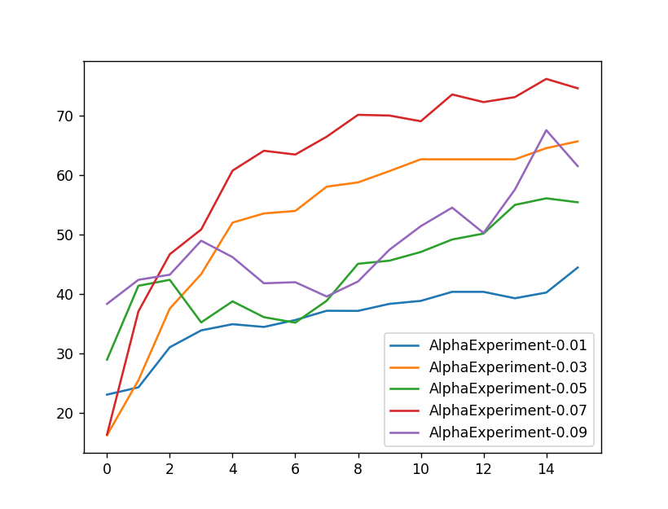

# Dophin RL

A reinforcement learning library that is designed to facilitate experimentation with a variety of RL methods and models of the state-value function. It comes with an experimentation framework that ensures that experiments are reproducible and persistent.

For an in-depth introduction to RL please refer to [Reinforcement Learning - An Introduction](https://mitpress.mit.edu/books/reinforcement-learning-second-edition) by Richard S. Sutton and Andrew G. Barto.

## Getting started:

The most basic steps to train a policy are listed below. The [General Training notebook](SamplesSource/GeneralTraining.ipynb) contains a more comprehensive example of how to train and evaluate a policy for solving the CleanBot environment.

**Choose an environment**. Dolphin RL users [OpenAI gym](https://gym.openai.com/docs/) to represent environments and comes with the [CleanBot](SamplesSource/CleanBotEnv.py) sample environment. 


```python
env = CleanBotEnv(4)
```

**Choose a model of the state-value function**. The example below uses neural network based representation, which can only approximate the state-value function, but has the advantage that it can generalize experience to states of the environment it has not encountered during training. Alternatively, a [table based model](Source/Models/TableModel.py) could be used.


```python
model = KerasModel(env, conv1_model(env), batch_size=64)
```

**Choose a reinforcement learning method and policy**. The example below uses the Sarsa method. It is very flexible in that is works with environments that have very long or infinite episodes, but in its simplest form will likely  converge slower than e.g. a [Monte Carlo method](Source/Methods/MonteCarlo.py).


```python
training_policy = EpsilonGreedyPolicy(model, exploration=0.1)
method = Sarsa(env, model, training_policy)
```

**Train the policy** by running a few episodes and improve the policy in the process.


```python
episode_count = 100
for i in range(episode_count):
    method.run_episode()
```

**Evaluate the performance** of the policy by calculating the average reward received over a number of episodes


```python
validation_policy = GreedyPolicy(model)
validate_policy(env, validation_policy, episode_count=20)
```

## Experimentation Framework:

It is often desirable to compare the performance of different RL methods or the impact of different changing value of meta parameters. The experiments framework helps to ensure that those experiments are reproducible, documented, and results are safely stored on disk.

The code below show how to turn the setup above into an experiment to see how different values of alpha affect the speed of learning:


```python
class AlphaExperiment(Experiment):
    def __init__(self, alpha):
        super().__init__()
        self.env = CleanBotEnv(4)
        self.model = KerasModel(self.env, conv1_model(self.env), batch_size=64)
        self.training_policy = EpsilonGreedyPolicy(self.model, 0.1)
        self.testing_policy = GreedyPolicy(self.model)
        self.method = Sarsa(self.env, self.model, self.training_policy, alpha=alpha)
        self.name = f"AlphaExperiment-{alpha:.2f}"
    
experiments = [{'alpha': a} for a in [0.01, 0.03, 0.05, 0.07, 0.09]]

expriment_suite = DefaultSuite(
    AlphaExperiment,
    experiments,
    episode_count=800,
    validation_frequency=50,
    validation_episode_count=50
)
run_experiment_suite(expriment_suite)
```

Running this experiment suite creates two files per value of *alpha*:

- **AlphaExperiment-*alpha*-validation_avg_reward.npy**: The average reward received when applying the policy to the validation instances of the environment
- **AlphaExperiment-*alpha*-model.h5**: The Keras model including learned weights and optimizer state

The code blow plots the performance of the policy applied to the validation instances of the environment during the progression of the training:


```python
fig = plt.figure()
ax = fig.add_subplot(111)
for alpha in [0.01, 0.03, 0.05, 0.07, 0.09]:
    name = f"AlphaExperiment-{alpha:.2f}"
    ax.plot(np.load(f"{name}-validation_avg_reward.npy"), label=name)
ax.legend()
```


